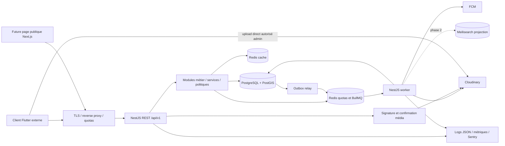
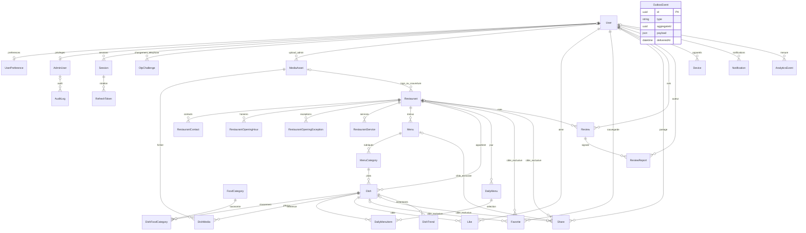

# Décisions et architecture

## Étape 1 — hypothèses challengées

| Hypothèse | Risque / ambiguïté | Décision V1 et compromis |
|---|---|---|
| Prix et disponibilité toujours vrais | Équipe éditoriale, sans système de caisse : données vieillissantes | `priceVerifiedAt`, affichage informatif, audit ; alerte éditoriale après 14 jours. La disponibilité déclarée ne garantit aucun stock. |
| 12 000 + accompagnement 8 000 nourrit 2 personnes | Prix seul ≠ portion ; panier disparate | Budget V1 = répétition d'un plat principal, portions renseignées. Accompagnements seuls exclus. Aucune combinaison supposée suffisante. |
| CDF et USD interchangeables | Taux vendeur, arrondis et volatilité | CDF prix de référence saisi ; USD facultatif saisi séparément ; aucune conversion implicite. |
| Chaque plat d'un menu est un produit distinct | Duplication si présent dans plusieurs menus | V1 : un plat appartient à une rubrique. DailyMenu référence ce plat sans copie. V2 : table de placement si multi-menu réellement nécessaire. |
| Slug change avec le nom | Rupture des partages et du cache mobile | Slug unique global par type, immutable, suffixe court d'UUID en cas de collision ; changement de nom indépendant. |
| Tous les utilisateurs doivent se connecter | Friction et collecte inutile | Découverte publique ; connexion pour likes, favoris, avis, profil et push personnalisé. |
| Avis = expérience vérifiée | Pas de commande/réservation pour prouver une visite | Un avis par utilisateur et restaurant, modifiable ; mention « avis non vérifié ». Avis sur les plats reportés. |
| Modérer après publication seulement | Spam au démarrage | Création/édition → PENDING ; validation humaine. Coût éditorial assumé. Mesurer délai et file d'attente. |
| Signalement implique masquage automatique | Brigading | Report OPEN n'altère pas à lui seul la visibilité ; FLAGGED réservé au triage modérateur, non public. |
| Partage = envoi WhatsApp confirmé | Le backend ne peut observer le destinataire | Mesure d'intention de partage, événement dédupliqué ; pas de preuve d'envoi. |
| Téléphone OTP immédiatement disponible | Fournisseur SMS, délivrabilité et coût en RDC inconnus | Port `OtpSender`, choix fournisseur après essai local. Google possible en parallèle. Pas de faux SMS de production. |
| Administrateur = simple JWT avec rôle | Vol de session et privilèges périmés | Compte admin provisionné, fournisseur d'identité avec MFA, rôle actif relu pour chaque commande. |
| Recherche langage naturel complète | « pizza gombe » mélange catégorie et localisation | Reconnaissance déterministe de communes et synonymes curés ; filtres explicites toujours prioritaires. Pas de NLP en V1. |
| Une seule base Redis suffit partout | Eviction cache contre durabilité des jobs | Une instance locale ; instances/cache et jobs-limiters séparées en production, politiques adaptées. |
| API production-ready = architecture exhaustive | Code et opérations non vérifiés | Dossier prêt à guider l'implémentation ; passage en production conditionné aux tests, providers, restauration et charge. |
| Trending reflète la qualité | Biais nouveauté, bots, gros restaurants | Acteurs uniques, plafonds par signal, moyenne bayésienne, instantanés explicables. Pas de ML. |
| Géolocalisation exacte dans analytics | Exposition des déplacements | Coordonnées utilisées en mémoire pour la requête ; au plus commune/cellule grossière dans événements consentis. |
| Toutes les options méritent une colonne | Surmodélisation | `servesPeople` et `isMainDish` nécessaires au budget ; épices, temps de préparation, tags libres reportés. Catégories globales suffisent. |

Ces choix sont les hypothèses retenues pour avancer. Les décisions externes encore nécessaires à la mise en service sont le domaine public, l'hébergement, le fournisseur OTP, le fournisseur MFA admin, les comptes Cloudinary/FCM/Sentry et le calendrier éditorial. Elles ne bloquent pas la conception.

## Étape 2 — monolithe modulaire

Un codebase, une base PostgreSQL source de vérité et deux processus : API NestJS et worker NestJS sans serveur HTTP public. Tous les domaines s'exécutent dans le monolithe ; les workers utilisent les mêmes services. Communication synchrone par interfaces exportées pour les décisions immédiates, outbox transactionnelle pour les effets différés. Aucun bus distribué métier, repository générique ou service par table imposé.



PostgreSQL décide toujours du prix, de la publication, de l'état utilisateur et de la disponibilité. Cache et index sont reconstructibles. Les modules ne s'importent pas mutuellement en cycle : les modules de lecture agrègent le catalogue ; le catalogue ne dépend pas de search/trending/recommendations. Admin est une façade d'autorisation appelant les services métier, pas un second chemin d'écriture Prisma.

Séparation application/domain/infrastructure/presentation dans **auth**, **restaurants** (horaires/états), **menus** (publication cohérente), **dishes** (prix/visibilité), **search** (port PostgreSQL/Meili), **budget** (algorithme), **reviews** (transitions/agrégats). Les autres modules gardent controller/service/dto avec un adapter/repository ciblé lorsque nécessaire. Nearby possède un repository SQL spécialisé ; la simplicité de son orchestration ne justifie pas quatre dossiers.

`common` contient seulement erreurs, enveloppes, identifiants, guards transverses, transactions/outbox et clients d'infrastructure. Les règles de prix vivent dans dishes/domain, celles de portions dans budget/domain. Prisma est injecté uniquement dans les repositories et services simples propriétaires de leurs tables. Une transaction est passée explicitement aux écritures liées ; aucun état transactionnel global.

## Arborescence cible complète (fichiers à créer à l'implémentation)

```text
src/
  main.ts                         # API bootstrap
  worker.ts                       # application context, jobs only
  app/{app.module,worker.module}.ts
  config/{env.schema,configuration}.ts
  common/
    database/{prisma.module,prisma.service,transaction.service}.ts
    cache/{cache.module,cache.service}.ts
    events/{outbox.service,event.types}.ts
    http/{response.interceptor,exception.filter,cursor.codec,request-id.middleware}.ts
    security/{jwt.guard,permissions.guard,current-user.decorator,public.decorator,rate-limit.guard}.ts
    logging/{logging.module,redaction}.ts
  auth/
    auth.module.ts
    application/{auth.service,otp.service,session.service,phone-change.service}.ts
    domain/{session-policy,otp-sender.port,identity-verifier.port}.ts
    infrastructure/{auth.repository,google-identity.adapter,sms.adapter}.ts
    presentation/{auth.controller,auth.dto}.ts
  restaurants/
    restaurants.module.ts
    application/restaurants.service.ts
    domain/{opening-hours,restaurant-policy}.ts
    infrastructure/restaurants.repository.ts
    presentation/{restaurants.controller,restaurants.dto}.ts
  menus/
    menus.module.ts
    application/menus.service.ts
    domain/publication-policy.ts
    infrastructure/menus.repository.ts
    presentation/{menus.controller,menus.dto}.ts
  dishes/
    dishes.module.ts
    application/dishes.service.ts
    domain/{money,visibility-policy}.ts
    infrastructure/dishes.repository.ts
    presentation/{dishes.controller,dishes.dto}.ts
  search/
    search.module.ts
    application/search.service.ts
    domain/{search.port,normalization,synonyms}.ts
    infrastructure/{postgres-search.repository,meilisearch.adapter}.ts # Meili phase 2 seulement
    presentation/{search.controller,search.dto}.ts
  budget/
    budget.module.ts
    application/budget.service.ts
    domain/budget-engine.ts
    infrastructure/budget-candidates.repository.ts
    presentation/{budget.controller,budget.dto}.ts
  reviews/
    reviews.module.ts
    application/{reviews.service,rating.service}.ts
    domain/review-policy.ts
    infrastructure/reviews.repository.ts
    presentation/{reviews.controller,reviews.dto}.ts
  users/{users.module,users.controller,users.service,users.dto}.ts
  menu-categories/{menu-categories.module,menu-categories.service,menu-categories.dto}.ts
  categories/{categories.module,categories.controller,categories.service,categories.dto}.ts
  daily-menu/{daily-menu.module,daily-menu.controller,daily-menu.service,daily-menu.dto}.ts
  nearby/{nearby.module,nearby.controller,nearby.service,nearby.repository,nearby.dto}.ts
  trending/{trending.module,trending.controller,trending.service,trending.dto}.ts
  recommendations/{recommendations.module,recommendations.controller,recommendations.service}.ts
  likes/{likes.module,likes.controller,likes.service}.ts
  favorites/{favorites.module,favorites.controller,favorites.service}.ts
  shares/{shares.module,shares.controller,shares.service,shares.dto}.ts
  notifications/{notifications.module,notifications.controller,notifications.service,notifications.dto,fcm.adapter}.ts
  analytics/{analytics.module,analytics.controller,analytics.service,analytics.dto}.ts
  media/{media.module,media.service,media.dto,cloudinary.adapter}.ts
  deep-links/{deep-links.module,deep-links.controller,deep-links.service}.ts
  admin/{admin.module,admin-catalog.controller,admin-reviews.controller,admin-users.controller,admin.dto}.ts
  moderation/{moderation.module,moderation.controller,moderation.service,moderation.dto}.ts
  jobs/{jobs.module,outbox-relay,trending.processor,notifications.processor,cleanup.processor,reconcile.processor}.ts
  health/{health.module,health.controller,health.service}.ts
prisma/
  schema.prisma
  migrations/{000_extensions,001_core,002_invariants}/migration.sql
  seed.ts
  fixtures/{categories,communes,demo-restaurants}.json
  queries/{nearby,search,budget}.sql
scripts/{import-catalog,check-migrations,export-openapi}.ts
contracts/openapi.json
 test/
  unit/{auth,budget,opening-hours,review-policy,cursors,trending}.spec.ts
  integration/{constraints,search,postgis,sessions,engagement,ratings,outbox}.spec.ts
  e2e/{public,auth,admin,moderation,media,notifications}.e2e-spec.ts
  fixtures/{clock,providers,catalog}.ts
Dockerfile
compose.yaml
.env.example
.github/workflows/{ci,release}.yml
```

Les modules simples peuvent regrouper leurs DTOs tant que le fichier reste lisible. Les fichiers ci-dessus sont une cible, pas une déclaration de code existant.

## Domaine et ERD

Identifiants UUID ; timestamps `timestamptz(3)` UTC ; date du menu du jour SQL DATE. `MenuCategory` est une rubrique propre à un menu ; `FoodCategory` est une taxonomie globale, plusieurs catégories possibles par plat. RestaurantContact déduplique les coordonnées ; les réponses exposent phone/whatsapp/website via projection du premier contact trié par valeur, et `contacts` pour l'ensemble.



Les références historiques resourceType/resourceId d'analytics, audit et outbox ne sont pas des associations navigables : elles survivent aux retraits métier. Favoris/partages, eux, possèdent des FK et un CHECK « exactement une cible ». Les doubles FK composites empêchent un plat ou un daily-menu item d'appartenir au mauvais restaurant. Les index uniques `[id,restaurantId]` sont nécessaires à ces FK même si id est déjà unique.

Restaurant : DRAFT invisible ; ACTIVE visible et admissible à la découverte ; INACTIVE retiré par l'équipe ; TEMPORARILY_CLOSED accessible par lien et liste explicite avec statut, exclu des plats disponibles/proximité ouverte/budget ; PERMANENTLY_CLOSED accessible par lien avec fermeture, exclu de la découverte. Soft delete ⇒ 404 public, conservation administrative. Vérification éditoriale distincte de l'ouverture ; aucun effet sur les droits.

Un plat peut être marqué PUBLISHED alors que son menu reste DRAFT ; il demeure invisible jusqu’à publication du menu. Cette règle permet de préparer la publication sans dépendance circulaire.

Menu/Dish : DRAFT → PUBLISHED → ARCHIVED ; retour en DRAFT autorisé avec audit ; pas de version de contenu complète en V1. `version` est un entier de concurrence optimiste : UPDATE WHERE id AND version, incrément atomique ; zero ligne ⇒ 409 VERSION_CONFLICT. Slugs non réutilisés après suppression. Ordering `(position,id)` ; positions non uniques pour éviter les réordonnancements massifs. Photos `(dishId,position)` uniques : permutation en deux phases de positions temporaires positives dans une transaction.

## Prix et budget

CDF `NUMERIC(14,2)` ; USD `NUMERIC(12,2)` ; montants strictement positifs pour un plat. Une API écrit/lit des **chaînes décimales à deux chiffres**, jamais un nombre JSON monétaire. Valeur CDF maximale `999999999999.99`. Pas de notation exponentielle, séparateur de milliers ni virgule. L'API rejette une précision > 2 au lieu de laisser PostgreSQL arrondir silencieusement. Les calculs utilisent Decimal ou des centimes entiers BigInt. Arrondi HALF_UP uniquement pour une division d'affichage ; jamais pour décider de l'éligibilité. Label `currency: CDF`, `priceBasis: EDITORIAL`, `priceVerifiedAt`; USD n'est pas un budget alternatif V1.

Budget V1, par restaurant et plat : `quantity = ceil(people / servesPeople)` ; `total = quantity × priceCdf`. Filtrer total ≤ budget, plat principal, portion connue, publication de toute la chaîne, restaurant ACTIVE et disponibilité AVAILABLE. `servesPeople` est une déclaration éditoriale, pas une garantie nutritionnelle. `remainingBudget = budget - total` ; `pricePerPerson = total / people` arrondi à deux décimales. Aucun frais de livraison, déplacement ou supplément implicite.

Filtres : people 1..20 ; budget 1.00..10000000.00 CDF ; rayon 100..20000 m ; coordonnées toutes deux requises ; catégorie facultative. PostgreSQL/PostGIS filtre d'abord, puis calcule quantité et total avec NUMERIC dans la même requête. ORDER BY distanceMeters ASC, remainingBudget ASC, dishId ASC ; distance non arrondie pour le tri. Retour maximum 20, pagination offset plafonnée à 1000 ; pas de recherche combinatoire ni troncature cachée des candidats avant éligibilité. Index spatial et prix donnent les candidats ; timeout SQL 750 ms ; timeout ⇒ 503, jamais résultat incomplet présenté comme exhaustif.

Exemple pour 2 personnes, plat à 14 000.00 CDF, portion 1 : quantité 2, total 28 000.00, reste 2 000.00 sur 30 000.00 ; prix/personne 14 000.00. Pour portion 3 et 2 personnes, quantité 1 ; préciser `servesPeople:3` pour ne pas confondre quantité et convives. Résultat `[]` signifie aucune proposition trouvée avec ces filtres.

V2 : 2–3 lignes au maximum, même restaurant, seulement assemblages explicitement compatibles et portions connues ; budget dynamique borné sur les cents ou beam search avec borne de temps, jamais cross-restaurant implicite. V3 : re-ranking personnalisé consenti. Pas d'algorithme de sac à dos général en V1.

## Recherche et géographie

`Restaurant.location` = geography(Point,4326) ; latitude/longitude décimales sont les entrées canoniques, trigger synchronise toujours le point, y compris sur écriture SQL directe. L'ordre de ST_MakePoint est **longitude, latitude**. Champ `Unsupported` nullable dans Prisma pour permettre les créations Client ; SQL impose NOT NULL après trigger. Cette divergence est documentée et doit être conservée dans les migrations manuelles, jamais remplacée par `db push`.

Repository géographique dédié : `$queryRaw` taggé ou driver pg avec paramètres ; aucun `$queryRawUnsafe` avec concaténation utilisateur. Ne jamais sélectionner geography directement dans Prisma : sélectionner distance, ST_X/ST_Y si utile, et champs scalaires. ST_DWithin filtre au rayon avec index GiST ; ST_Distance ne sert qu'au tri/calcul des candidats. Distance géodésique en mètres, pas durée ni distance routière. [PostGIS confirme les unités et l'utilisation d'un filtre spatial indexable](https://postgis.net/docs/ST_DWithin.html).

Phase 1 : trim, espaces normalisés, minuscules, unaccent, dictionnaire français ; `websearch_to_tsquery('french', ...)`, GIN tsvector et pg_trgm sur search_text stocké par trigger. Pas de wrapper unaccent mensongèrement IMMUTABLE. Nom pondéré A, description B pour les plats. Les catégories (petit dictionnaire < 500 lignes) sont normalisées en mémoire depuis Redis/PostgreSQL ; inutile d'indexer chaque champ.

Synonymes versionnés dans `search/domain/synonyms.ts` : hamburger→burger, pitsa→pizza, poulet braise normalisé comme poulet braisé. Autocomplete q 2..80 caractères, max 10 ; requête principale q 2..120. Préfixe prioritaire, puis FTS, puis trigram (seuil initial 0.3 configurable, mesuré sur corpus), pas de fuzzy sur un caractère. Ranking : exact=3, préfixe=2, FTS=1+rank normalisé, fuzzy=similarity ; puis distance si fournie, id pour égalités. Recherche types séparés par sections afin de ne pas comparer arbitrairement un restaurant et un plat.

« pizza gombe » : extraire Gombe comme commune reconnue si filtre commune absent ; rechercher pizza dans Dish + catégories liées, ou dans Restaurant + EXISTS plat/catégorie correspondant. Le SQL planifie un UNION de sources d'identifiants (FTS/trigram/catégorie), déduplique, puis applique les filtres et le classement. « restaurant italien » utilise catégorie italienne via plats et texte restaurant. Prévoir un corpus éditorial pour ces termes ; ne pas prétendre comprendre n'importe quelle phrase. Les changements de catégories sont visibles par JOIN, pas une copie désynchronisée dans chaque document plat.

Budget + search + geo sont une requête PostgreSQL filtrée par prix et visibilité, join au restaurant et ST_DWithin. Meilisearch en phase 2 propose des IDs ordonnés ; PostgreSQL revalide chaque cible, prix et geo avant sortie. Sur filtres sélectifs : fetch progressif borné avec curseur moteur et continuation opaque, ou SQL de secours ; jamais LIMIT 20 Meili suivi d'un filtrage qui masquerait les suivants. Pas de total exact prétendu après revalidation. Index alimenté par outbox idempotente versionnée, réindexation dans nouvel index + swap, tombstones pour retraits, dernier version gagne. Aucun checkout/prix ne proviendra d'un moteur secondaire.

Déclencheur de migration : après optimisation et EXPLAIN ANALYZE sur données réalistes, p95 search > 400 ms plusieurs jours à charge cible, ou taux zéro résultat/pertinence insuffisante dans corpus humain et besoin multi-langue. Un volume de 100 000–300 000 plats est un repère pour un benchmark, pas un seuil universel. Budget/geo restent dans PostgreSQL.

## Tendances et recommandations

Fenêtre glissante 7 jours, buckets horaires ; vues qualifiées uniques par acteur/plat/jour ; likes/favoris seulement relations encore présentes créées dans la fenêtre ; shares qualifiés ; avis publiés restaurant utilisés pour qualité, pas présentés comme avis du plat.

`E = ln(1+V) + 3 ln(1+L) + 4 ln(1+F) + 2 ln(1+S)`.
`Q = ((ratingSum + 10×3.5)/(reviewCount+10))/5` (prior initial explicite, à recalibrer).
`freshness = 0.8 + 0.2 exp(-ageDays/14)` ; `score = E × Q × freshness`.
Localité = filtre commune/rayon, puis tie-break distance ; ne multiplier aucun pseudo-signal géographique global. Plafonds V ≤ 10000, L/F/S ≤ 1000 par plat/fenêtre pour limiter l'influence extrême ; filtres anti-abuse en amont. `featured` est un choix éditorial distinct, ne modifie pas discrètement le score.

Job toutes les 15 min écrit un snapshot complet DishTrend, avec composantes V/L/F/S/Q/freshness et version de formule. Publier le pointeur snapshot Redis seulement après commit. Une page utilise le même snapshotAt, curseur `(snapshotAt,score,dishId)` ; snapshots conservés 2 h, curseurs expirent après 1 h. Retour 410 CURSOR_EXPIRED si snapshot supprimé. Toujours revalider la visibilité en base avant réponse. Recalcul reproductible à partir des sources et version de formule pendant leur rétention ; au-delà, snapshots d'agrégats suffisent pour comparaison, pas reconstitution individuelle.

Recommendations V1 orchestre catégories éditoriales + tendances locales, explique `reason: LOCAL_TRENDING` ou `EDITORIAL`. Pas de profilage comportemental caché ; pas de table Recommendation ou modèle ML.

## Règles critiques (Given / When / Then)

### RULE PRICE
Given: un prix CDF saisi comme chaîne. When: création/modification. Then: regex et limites vérifiées avant Decimal, audit transactionnel, version incrémentée. Edge cases: `1e3`, `NaN`, `-0.00`, trois décimales, overflow rejetés. Tests: bornes, centimes exacts, prix USD absent et indépendant.

### RULE VISIBILITY
Given: restaurant/menu/rubrique/plat. When: lecture publique ou recherche. Then: vérifier chaque ancêtre, suppression et publication ; budget exige aussi ACTIVE/AVAILABLE. Edge cases: menu retiré après snapshot/cache, restaurant temporairement fermé ; revalidation avant servir. Tests: matrice des états et invalidation.

### RULE LIKE
Given: utilisateur actif et plat public. When: POST like. Then: INSERT ON CONFLICT DO NOTHING RETURNING ; incrément seulement si ligne insérée, dans même transaction. DELETE supprime si présent et décrémente seulement si supprimé. Edge cases: requêtes simultanées, retries, suppression de compte ; compteur jamais négatif. Tests: 50 likes concurrents = une relation et +1 ; 50 suppressions = 0 et -1. DELETE autorisé pour son propre like même si plat devenu non public.

### RULE FAVORITE
Given: une cible plat OU restaurant. When: sauvegarde. Then: CHECK XOR, unique utilisateur/cible ; réponse idempotente. Edge cases: les deux IDs ou aucun rejetés, cible retirée inaccessible au public ; listing personnel retourne tombstone `{id,type,unavailable:true}`. Tests: contraintes SQL et lecture sans fuite de contenu retiré.

### RULE REVIEW
Given: utilisateur actif, restaurant public, aucun avis actif personnel supplémentaire. When: créer/éditer. Then: une ligne par paire ; état PENDING, texte brut, propriétaire seulement. Ancien avis publié retiré des agrégats dans la même transaction. Edge cases: avis DELETED réactivé par PUT en PENDING ; HIDDEN/FLAGGED non restaurables par auteur, 409 jusqu'à décision modérateur. Tests: concurrence, edits, masquage, publication, réactivation, autorisation.

### RULE MODERATION
Given: avis PENDING/PUBLISHED/FLAGGED. When: modérateur intervient avec raison. Then: transitions PENDING→PUBLISHED/HIDDEN ; PUBLISHED→FLAGGED/HIDDEN ; FLAGGED→PUBLISHED/HIDDEN ; HIDDEN→PENDING ; tout état non DELETED→DELETED ; DELETED terminal côté admin V1. Report OPEN→DISMISSED/ACTIONED. Edge cases: signaler seul ne cache pas, double décision avec ancienne version ⇒ 409. Tests: toutes les transitions autorisées/interdites et audit.

### RULE RATINGS
Given: ancienne et nouvelle version d'un avis. When: statut/rating change. Then: verrouiller restaurant puis avis (ordre constant), calculer delta des contributions PUBLISHED, update ratingSum/reviewCount/distribution[5] atomiquement. averageRating = null si count=0 sinon HALF_UP(sum/count,2), calcul O(1). Edge cases: edition published→pending, suppression, suspension auteur (lecture auteur ACTIVE immédiate et agrégat éventuellement retardé <5 min, job surveillé). Tests: concurrence publication/suppression, invariants histogramme. Réconciliation nocturne sous même verrou restaurant, comparaison au calcul exact ; pas d'écrasement d'un delta concurrent.

### RULE DAILY_MENU
Given: date locale D. When: publier/lire. Then: startsAt = minuit D Kinshasa, expiresAt = minuit D+1 ; présent seulement si startsAt ≤ now < expiresAt et PUBLISHED, non supprimé, restaurant ACTIVE, items publics disponibles. Edge cases: 2026-09-07 local commence 2026-09-06T23:00:00Z ; worker arrêté, journée future, date demandée passée. Tests: horloge figée de part et d'autre de minuit. GET courant ne sert jamais d'archive.

### RULE OPEN_NOW
Given: heure locale, weekday ISO et éventuelle exception datée. When: calcul ouverture. Then: intervalle `[opensMinute,closesMinute)` ; aucune plage = fermé, exception remplace la semaine. Overnight vendredi 22h–samedi 02h devient vendredi [1320,1440), samedi [0,120). Edge cases: 24h=[0,1440), bornes exactes, fermeture exceptionnelle couvre le jour complet, fermeture temporaire domine les plages. Tests: dim/lun, multiples plages, chevauchements, minuit, priorité statut/exception.

### RULE REFRESH
Given: secret refresh aléatoire et session active. When: rotation. Then: verrouiller session, retrouver hash, vérifier expiration/usedAt, marquer consommé et créer successeur dans une transaction. Réutilisation ⇒ révoquer toute session (famille), commit révocation puis retourner 401. Edge cases: deux refresh concurrents : le second révoque la famille ; client doit sérialiser ; token inconnu ne doit pas révoquer une famille devinée. Tests: race, replay, logout, expiré, compte supprimé. Ne pas throw avant commit de la révocation.

### RULE UPLOAD
Given: admin autorisé, MediaAsset PENDING généré serveur. When: confirmation. Then: interroger Cloudinary côté serveur et vérifier publicId exact, assetId, format, octets, dimensions, version ; transition READY atomique. Edge cases: signature réutilisée, faux metadata, deux confirmations, fichier PDF renommé JPEG, ressource expirée. Tests: provider mock et sandbox, refus avant association, remplacement conserve ancien asset jusqu'au commit.

### RULE AUDIT_OUTBOX
Given: modification critique de catalogue/avis/RBAC. When: commit. Then: mutation + audit expurgé + événement outbox dans une transaction unique. Edge cases: crash avant/après enqueue, duplicate worker, provider indisponible. Tests: rollback global, replay sans double agrégat, DLQ. Audit n'enregistre jamais OTP/token/secret.

## Décision finale

**Menu2Kin Backend : Node.js + TypeScript + NestJS + PostgreSQL + PostGIS + Prisma + Redis + Cloudinary + FCM.**

ARCHITECTURE → monolithe modulaire, API et workers indépendamment réplicables.
DATABASE → relationnelle, contraintes fortes, NUMERIC, audit et outbox.
API → REST JSON `/api/v1`, contrats stricts et découverte publique.
SEARCH → PostgreSQL FTS/trigram ; Meilisearch seulement après mesure.
GEO → geography, GiST, ST_DWithin, distance en mètres.
BUDGET ENGINE → quantités d'un plat principal à portion connue, calcul exact.
TRENDING → agrégats explicables et snapshots, sans ML.
AUTH → OTP/Google, JWT court, refresh opaque rotatif, MFA admin.
SECURITY → validation, RBAC et état de session relus, quotas partagés, audit.
OBSERVABILITY → logs JSON, métriques, request ID, Sentry et sondes distinctes.
TESTING → Jest/Supertest, vrai PostgreSQL/PostGIS/Redis, concurrence et contrats.
SCALING → index, pooling, cache ciblé, workers puis réplicas ; décision par mesures.
FUTURE → domaines autonomes pour social, restaurant accounts, réservation, commandes, paiements et livraison ; aucun implémenté V1.
