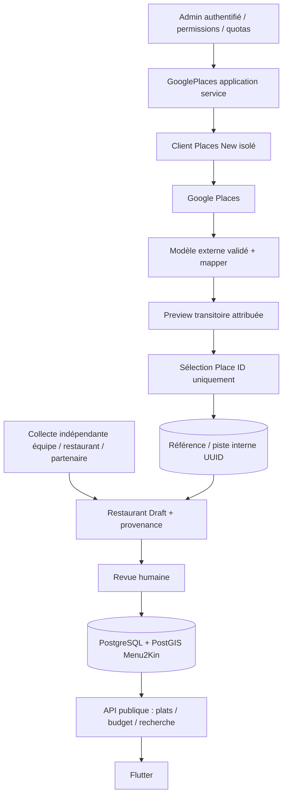

# Architecture et frontière des données

## Étape 1 — challenge des hypothèses

| Hypothèse | Risque | Décision retenue |
|---|---|---|
| « Je sélectionne un restaurant, je copie sa fiche » | Stockage de contenu soumis à restrictions, même pour un seul établissement | Ne pas importer nom/adresse/téléphone/horaires comme contenu propriétaire ; sélection durable limitée à la référence externe |
| « L'admin confirme, donc le champ devient Menu2Kin » | Changement d'étiquette sans changement d'origine | Une validation visuelle n'est pas une collecte indépendante ni une licence ; conserver la vraie provenance |
| « 30 jours de cache pour toute la fiche » | Exception de coordonnées étendue abusivement aux autres champs | Aucun cache de fiche ; exception coordonnées étudiée séparément et non utilisée V1 |
| « Nom + coordonnées Google suffisent à publier » | Mauvais lieu, point approximatif, prix et stock inconnus | Données Menu2Kin indépendantes, contrôle d'identité et publication humaine |
| « Google Place ID est l'identité restaurant » | ID modifié, déplacé, plusieurs IDs pour un même lieu | UUID interne, Place IDs comme références facultatives et alias contrôlés |
| « Importer toute Kinshasa optimise le lancement » | Aspiration, coût et faible qualité éditoriale | Sélections manuelles liées à une campagne de collecte, aucun quadrillage automatique |
| « Google BusinessStatus = vérification Menu2Kin » | Confusion existence/activité/validation | Statut opérationnel, publication et vérification séparés |
| « Refresh remplace les champs anciens » | Écrasement d'une correction humaine, recopie non autorisée | Comparaison temporaire ; canonical jamais modifié par le client Google |
| « Notes/photos enrichissent gratuitement la recherche » | SKU plus cher, droits et attribution, mélange de réputation | Aucun rating/review/photo dans les masks V1 |
| « Nearby est une liste exhaustive avec pages » | Résultats plafonnés et couverture variable | Échantillon de candidats, aucune complétude ni pagination Nearby inventée |
| « Tout passe par BullMQ » | Complexité et snapshots Google persistés dans jobs | HTTP synchrone borné pour sélection unique ; aucune queue nécessaire au départ |
| « On peut publier les routes admin tout de suite » | Backend actuel sans auth admin ni DB | Client interne seulement ; activation des controllers après socle sécurité/persistance |

### Conditions vérifiées et limites de la conclusion

Les conditions générales hors EEE, §3.2.3(a–c), restreignent extraction, conservation et création de contenu à partir du contenu Maps ; la copie sauvegardée de noms/adresses d'établissements y est expressément visée. Ce constat exclut l'approbation du workflow de copie durable proposé initialement. [Conditions générales actuelles](https://cloud.google.com/maps-platform/terms).

Le régime consulté permet de conserver les Place IDs selon la documentation ; l'exception de cache Places pour latitude/longitude est limitée à 30 jours calendaires consécutifs, avec suppression ensuite. L'utilisation sans carte est possible, mais le régime hors EEE interdit d'utiliser le contenu Places avec une carte non Google. Ces exceptions ne constituent pas une autorisation générale de constituer un catalogue autonome à partir des réponses. [Conditions spécifiques actuelles, A.3 et B.14](https://cloud.google.com/maps-platform/terms/maps-service-terms).

**Choix d'architecture, pas conclusion juridique globale :** ne persister aucun contenu de fiche Google, ne pas utiliser ses coordonnées pour le moteur public ; obtenir les données durables via visite de l'équipe, déclaration du restaurant ou partenaire autorisé. Faire confirmer que la finalité précise de prospection/découverte envisagée est couverte par l'accord du compte avant appels de production. Si elle ne l'est pas, collecter le catalogue directement auprès des établissements et garder Google hors de ce workflow. La faible volumétrie et une revue humaine ne dispensent pas du respect des conditions.

Ne pas appliquer à Places les permissions distinctes d'Address Validation ou Geocoding. L'exception Autocomplete pour l'adresse fournie par un utilisateur dans sa transaction ne s'étend pas à un lookup de restaurant destiné au catalogue. Le régime EEE est différent et n'est pas celui retenu pour ce compte. [Politiques Places](https://developers.google.com/maps/documentation/places/web-service/policies), [conditions EEE](https://cloud.google.com/terms/maps-platform/eea/maps-service-terms).

## Étape 2 — GOOGLE DATA / MENU2KIN DATA

**GOOGLE DATA :** réponse externe à afficher temporairement dans la consultation admin, attributions et Place ID. Le module la rend explicite par `source=GOOGLE`, `retention=TRANSIENT_NO_STORE`. Elle ne satisfait jamais directement un DTO de création Restaurant.

**MENU2KIN DATA :** identité commerciale documentée indépendamment, coordonnées relevées/communiquées avec droits d'utilisation, menu, plats, prix, disponibilités, médias autorisés, événements d'engagement et avis natifs. `Restaurant.id` est un UUID stable. Une valeur identique à celle de Google peut être Menu2Kin seulement si sa propre collecte/licence est réellement établie ; pas parce qu'un bouton « confirmer » a été cliqué.

### Matrice architecturale obligatoire

Codes : **G0** = réponse Google transitoire, aucune persistance/cache applicatif ; **ID** = exception Place ID ; **M** = donnée indépendante avec preuve/source ; **OFF** = non demandée. Les règles de stockage ici sont les **choix restrictifs du produit** sous le régime consulté, pas une nouvelle liste de permissions Google.

| FIELD | SOURCE | STORAGE | DISPLAY | REFRESH | OVERRIDE |
|---|---|---|---|---|---|
| googlePlaceId | Google, référence externe nécessaire | ID : unique dans référence, durable | Admin ; facultatif pour lien externe public | Contrôle identifiant ancien, pas contenu | Réassociation contrôlée, jamais changement UUID |
| name | Google pour identification / M pour catalogue | G0 / M dans Restaurant.name | Preview attribuée / nom Menu2Kin public | Nouvelle preview à la demande | Pas de copie durable depuis G0 |
| address | Google preview / M adresse collectée | G0 / M dans Restaurant.address | Deux provenances distinctes | Comparaison temporaire | Nouvelle collecte indépendante |
| latitude | Google preview / M relevé propre | G0 V1 / M canonique | Google admin seulement / M geo public | Pas de refresh des coordonnées M | Coordonnées M sous contrôle humain |
| longitude | Même couple de provenance que latitude | Même règle, couple atomique | Même règle | Même règle | Pas de mélange d'axes provenant de sources différentes |
| phone | Google contact optionnel / M confirmé restaurant | G0 / M contact canonique | Preview contact attribuée / contact M public | Sur demande seulement | Contact confirmé par preuve, pas collage |
| openingHours | Google contact optionnel / M horaires obtenus | G0 / M plages horaires | Provenance explicite | Google preview seulement | Plages M inchangées automatiquement |
| types | Google indication / taxonomie M | G0 / FoodCategory M indépendante | Admin seulement pour type Google | Avec Details identity | Aucun mapping Google→FoodCategory persisté par défaut |
| menu | Menu2Kin / restaurant autorisé | M | Public si publié | Cycle éditorial interne | Jamais Google |
| dish | Menu2Kin / restaurant autorisé | M | Public si publié | Interne | Jamais Google |
| price | Menu2Kin / restaurant autorisé | M NUMERIC ; devises explicites | Prix et date de vérification M | Révision éditoriale | Aucun priceLevel Google converti en prix |
| availability | Équipe/restaurant | M | Disponibilité déclarée M | Interne | Google businessStatus ne la remplace pas |
| photo | M privilégié ; Google OFF | Cloudinary pour M ; rien de Google | M public ; affichage Google futur séparé | Médias M versionnés | Pas de transfert Google→Cloudinary |
| rating | Avis Menu2Kin ; Google OFF | Agrégats natifs M | Note Menu2Kin seulement V1 | Delta transactionnel natif | Aucun mélange, aucune moyenne combinée |
| reviews | Utilisateurs Menu2Kin ; Google OFF | Review M et modération | Avis publiés natifs | Interne | Aucun import Google |

`name/address/location` sont nécessaires pour une sélection admin utile. `phone/openingHours` ne sont demandés que sur action de consultation contact. Types ne constituent ni le menu ni une preuve de spécialité culinaire. Google prix, photos, horaires temps réel, avis et notes sont inutiles à la sélection minimale.

### Affichage, attribution et médias

Toute restitution d'une preview doit porter l'attribution **Google Maps** et les attributions tierces reçues, près du contenu Google et distinctes du contenu Menu2Kin. Le contrat backend transmet `attributions[]`; un tableau vide ne supprime pas l'obligation de marque. Aucun détail d'écran ni composant frontend n'est conçu ici. Les obligations s'appliquent également à un back-office interne. Prévoir les conditions d'utilisation et la politique de confidentialité applicables. [Règles d'attribution Places](https://developers.google.com/maps/documentation/places/web-service/policies).

V1 n'affiche aucune donnée Google dans Flutter. Une option future photo Google devra charger le média à la demande par le mécanisme Places, transmettre l'attribution d'auteur et le lien source requis ; le nom de ressource photo ne doit pas devenir une référence persistante, il peut expirer. Pas de cache image/photoName chez nous ni de réhébergement Cloudinary proposé. [Place Photos New](https://developers.google.com/maps/documentation/places/web-service/place-photos). Si des photos/avis sont ajoutés plus tard, revoir également les règles d'attribution en vigueur, sans généraliser une exception de cache.

## Étape 3 — architecture générale



Google n'a aucun chemin direct vers Prisma.create(Restaurant). Une réponse externe est validée, présentée temporairement, puis projetée en référence. La création du vrai brouillon exige un DTO de données indépendantes. L'API publique ne dépend ni du client Places ni d'une clé Google ni d'un renouvellement de contenu Google.

### Arborescence cible et responsabilités

```text
src/google-places/
  google-places.module.ts                 # existant, DI client, aucun controller exposé
  domain/
    google-place.ts                      # existant, preview, mapper, whitelist référence
    duplicate-policy.ts                  # proposé, critères de match d'identité
    field-provenance.policy.ts           # proposé, interdiction promotion implicite de source
  infrastructure/
    google-places.client.ts              # existant, fetch isolé, masks, erreurs, timeouts
    google-reference.repository.ts       # proposé, seule table référence autorisée
  application/
    discovery.service.ts                 # proposé, quotas + client + previews
    import-reference.service.ts          # proposé, idempotence/concurrence/référence
    duplicate-check.service.ts           # proposé, lecture catalogue et décision
    refresh-preview.service.ts           # proposé, diff transitoire, aucun overwrite
  presentation/
    admin-google-places.controller.ts    # proposé, guards RBAC et DTOs stricts
    google-places.dto.ts                 # proposé, contrats api.md
  google-places.spec.ts                   # existant, mocks transport, mapping et sécurité
src/restaurants/                        # cible canonique et provenance indépendante
src/admin/                              # auth forte, RBAC, revue/audit
src/common/database/                    # Prisma/PostGIS partagé
```

Dépendances unidirectionnelles : google-places/application → port de lecture/création restaurants ; restaurants/domain ne dépend pas de Google. Menus, dishes, reviews ne connaissent pas le SDK/provider. Le controller orchestre HTTP seulement ; choix de source, règle de doublon et transaction vivent dans les services métier. Pas de microservice, ni repository générique.

## Architecture finale

```text
GOOGLE PLACES
↓
DISCOVERY / ENRICHMENT TRANSITOIRE ATTRIBUÉ
↓
ADMIN REVIEW + COLLECTE INDÉPENDANTE DOCUMENTÉE
↓
MENU2KIN DATABASE (UUID internes ; Place ID facultatif)
↓
MENUS + DISHES + PRICES
↓
SEARCH / GEO / BUDGET / TRENDING
↓
FLUTTER USERS
```

La référence accélère l'identification ; la collecte documentée protège la qualité durable. Les masques et consultations volontaires réduisent les appels. La contrainte unique évite la répétition exacte, la vérification humaine traite l'incertitude. Les données propres garantissent la continuité sans Google et évitent de prendre le cache temporaire pour une base alimentaire. Ce schéma minimise les risques identifiés ; il ne promet ni exhaustivité des restaurants ni conformité automatique de tout futur usage.
