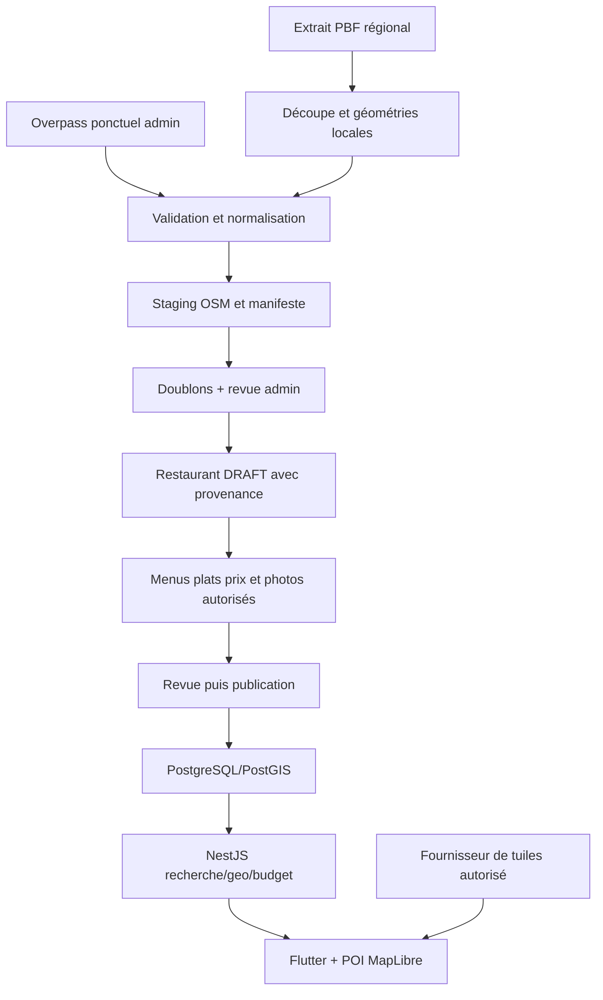

# Architecture, frontière des données et pipeline

## Hypothèses challengées

- « Gratuit » décrit la licence des données, pas l'hébergement des services ou notre exploitation.
- Un restaurant absent d'OSM peut exister ; un POI présent peut être fermé. Aucun taux de couverture Kinshasa n'est établi ici.
- Un centre de bâtiment n'est pas une entrée, et la proximité du fleuve exige d'éviter la confusion Kinshasa/Brazzaville.
- `cuisine=pizza` ne prouve ni un plat au menu ni son prix/disponibilité.
- Un ID OSM numérique n'est unique qu'avec son type ; un restaurant peut avoir plusieurs objets OSM.
- Contrôle humain et copie manuelle ne suppriment pas la provenance ni l'ODbL.
- Une structure prête pour une exploitation robuste exige droits admin, DB, audits, reprise de jobs et tests ; les seuls mappers livrés ne rendent pas l'application actuelle prête pour production.

## Matrice obligatoire

`O` : contenu OSM conservable/affichable sous ODbL et attribution, intégré à la couche dérivée. `M` : données indépendamment collectées, droits propres vérifiés. OWNER indique la responsabilité/droits de source, pas un transfert de propriété à Menu2Kin. Rafraîchissement « revue » signifie proposition, jamais écrasement automatique.

| DATA | SOURCE | STORE | DISPLAY | REFRESH | OWNER |
|---|---|---|---|---|---| 
| osmId + osmType | OSM | O, référence composite, ID chaîne | lien source admin ; licence publique | version/snapshot | contributeurs OSM / ODbL |
| name | OSM ou collecte | O si copié ; M si indépendant | nom + attribution si O | revue par champ | source tracée |
| address (street, house number, postcode, city, district) | tags OSM ou collecte | composants nullable, pas d'adresse inventée | seulement composants connus | revue, géographie distincte | source tracée |
| latitude | nœud, géométrie OSM ou relevé | O ou M ; précision/méthode | marqueur et provenance | déplacement en revue | source tracée |
| longitude | idem | idem ; ordre SQL/GeoJSON lon,lat | idem | idem | source tracée |
| phone | contact:phone/phone ou restaurant | brut source + normalisé valide séparé | contact vérifié si publication | revue ; aucune déduction WhatsApp | source tracée |
| openingHours | opening_hours ou restaurant | expression brute O ; planning propre seulement après interprétation/revue | texte marqué non vérifié, puis planning validé | revue | source tracée |
| cuisine | OSM | liste indicative, tags inconnus conservés dans staging | contexte de lieu, pas liste de plats | revue | ODbL si O |
| amenity | OSM | type externe et mapping interne contrôlé | catégorie de lieu | revue | ODbL |
| website | contact:website/website ou restaurant | URL http(s) validée ; aucun fetch automatique | lien sûr si validé | revue | source tracée ; contenu du site distinct |
| menu | équipe/restaurant/partenaire autorisé | M | oui | édition métier | droits Menu2Kin/concédant |
| dish | idem | M | oui | édition métier | idem |
| price | idem | M, montants CDF exacts | oui | contrôle fréquent daté | idem |
| availability | Menu2Kin | M | oui | métier, pas OSM | Menu2Kin |
| photo | équipe/restaurant autorisé | média Cloudinary + preuve de droits | oui | remplacement métier | auteur/ayant droit |
| rating | avis Menu2Kin | agrégat propre | note explicitement Menu2Kin | recalcul avis modérés | système Menu2Kin |
| reviews | utilisateurs Menu2Kin | M + modération | avis autorisés | modération | auteurs et droits accordés |

Likes, favoris, partages, menus du jour, tendances et recommandations restent également indépendants des sources POI. Les politiques de stockage Google ne s'appliquent pas à OSM et les droits OSM ne s'étendent pas aux données Google.

## Séparation NestJS proposée

```text
src/
  osm/
    domain/osm-candidate.ts            # LIVRÉ : validation/normalisation et règles pures
    domain/osm-candidate.spec.ts       # LIVRÉ : tests hors ligne
    infrastructure/overpass.client.ts  # PROPOSÉ : transport borné, requête fixe, pas de QL client
    infrastructure/pbf-reader.ts       # PROPOSÉ : adapteur du flux extrait local
    osm.module.ts                     # PROPOSÉ : DI, aucun accès public
  ingestion/
    ingestion.service.ts              # PROPOSÉ : lots persistants, staging, progression
    ingestion.worker.ts               # PROPOSÉ : une exécution à la fois
  restaurants/
    application/import-candidate.ts   # PROPOSÉ : idempotence + transaction DRAFT
    application/check-duplicate.ts    # PROPOSÉ : requête PostGIS et classement explicable
    application/refresh-source.ts     # PROPOSÉ : diff et acceptation explicite
    domain/provenance.ts              # PROPOSÉ : provenance/locks par champ
  geo/                                # limites locales, attribution, résolution de zone
  nearby/                             # PostGIS, aucune dépendance OSM réseau
  search/                             # recherche Dish/Restaurant/Category propre
  menus/ dishes/ categories/ reviews/  # domaines alimentaires du dossier général
  admin/                              # guards, controllers fins, audit
  common/database/                    # Prisma + SQL paramétré
```

Pas de modules globaux `mapper`, `duplicate`, `sync` sans propriétaire : le mapper externe appartient à osm, la décision de doublon et l'écriture à restaurants. `ingestion` orchestre les tâches longues et ne connaît pas les menus. Un port de lecture/écriture spécifique suffit ; aucun repository générique. La configuration serveur choisit le fournisseur ; une route ne peut imposer une URL arbitraire.



## Géographie et tags retenus

Démarrer par Gombe puis Limete, Ngaliema, Kintambo, Bandalungwa et Lemba selon capacité de collecte. Enregistrer les limites Kinshasa et communes dans `GeoArea` avec source, version et date de validation ; aucun ID de relation ou polygone exact n'est inventé ici. Un polygone éditorial peut lancer un pilote s'il est identifié comme zone opérationnelle, pas limite administrative officielle.

Découpage grossier du fichier autour de Kinshasa avec marge, conservation des membres de ways/relations, puis filtre spatial exact sur les géométries reconstruites. Le bounding box seul peut inclure des POI hors ville ; un cercle n'est pas une commune. Sur une frontière, utiliser ST_Covers et mettre les ambiguïtés en revue. Les multipolygones incomplets/invalides restent en quarantaine ; pas de centre 0,0 ni de correction silencieuse détruisant la géométrie. Les communes non documentées restent UNKNOWN.

V1 automatique : `amenity=restaurant`, `fast_food`, `cafe`. Café = lieu candidat, pas garantie de repas complet. `bar`, `pub`, `biergarten` sont des options de sourcing après validation produit/indice explicite de nourriture, pas import automatique ; boulangerie/food_court/ice_cream attendent une décision de catégorie. Ne pas importer les autres équipements ; un restaurant distinct dans un hôtel peut être admissible s'il est identifié indépendamment. Tags disused/abandoned/demolished/visible=false empêchent l'import non revu. `cuisine` est multi-valeur séparée par `;` et informative. [Documentation cuisine](https://wiki.openstreetmap.org/wiki/Key:cuisine).

## Pipeline PBF reproductible

1. Créer un job admin avec zone/version, source approuvée et filtre versionné. Télécharger une seule fois le snapshot choisi, dater/hash et limiter taille/disque ; aucun URL libre dans le body.
2. Utilitaire Osmium dans un worker isolé : découper la zone avec stratégie préservant références nécessaires, filtrer les tags en conservant les objets référencés, reconstruire les surfaces et exporter un flux de features. Pas de `JSON.parse` du PBF complet dans NestJS. Vérifier les références et les échecs de géométrie avant de marquer le snapshot complet. [Osmium extract](https://docs.osmcode.org/osmium/latest/osmium-extract.html), [export](https://docs.osmcode.org/osmium/latest/osmium-export.html).
3. Nœud → point source. Surface de way/relation → ST_PointOnSurface, méthode SURFACE_POINT, pas prétention d'entrée de restaurant ; conserver référence et qualité. Ligne sans surface/entrée explicite → revue. Le centre `out center` Overpass est le centre de bounding box et peut être hors du polygone ; le code livré le signale APPROXIMATE_POINT. [Overpass QL](https://wiki.openstreetmap.org/wiki/Overpass_API/Overpass_QL), [PostGIS](https://postgis.net/docs/ST_PointOnSurface.html).
4. Adaptateur externe → candidat normalisé. Import PBF conserve osmType/id/version et timestamp snapshot ; le format intermédiaire PBF et sa conversion ne sont pas encore codés. Le parser livré prend un JSON Overpass déjà décodé, pas un PBF.
5. Stager par clé composite. Tags utiles seulement ; ne pas importer users/uid/changeset authors, médias, descriptions HTML ou contenu lié. Cap interne 5 000 objets par réponse exploratoire, validation atomique de l'enveloppe ; traitement PBF par flux et lots bornés.
6. Produire compteurs validés/rejetés/hors périmètre et liste des candidats ; trier pour revue. Aucun candidat ne devient PUBLISHED durant l'ingestion.

Une réponse Overpass HTTP 200 avec `remark` peut être partielle : rejeter le snapshot comme incomplet. Un résultat tronqué ne prouve ni la disparition d'un POI ni l'exhaustivité d'une zone. Pour un ID connu, lire le staging local par défaut. Pas de fan-out d'un appel réseau par candidat.

## Normalisation et qualité

OSM ID : type enum node/way/relation + BIGINT positif ; JSON décimal string. Refuser les nombres JS hors safe integer déjà arrondis. UUID métier indépendant. Name d'affichage conservé ; clé de matching normalisée Unicode/accents/espaces, sans supprimer aveuglément les mots qui distinguent les succursales. Pas de name inventé depuis brand.

Téléphone : conserver la chaîne source ; future normalisation E.164 uniquement si un parseur fiable valide pays/numéro, sinon avertissement. Pas d'ajout automatique `+243` sur une donnée ambiguë. Website : URL http(s), pas de credentials, pas de fetch ; domaines partagés ne prouvent pas identité. Horaires : garder `opening_hours` brut ; pas de conversion naïve en lignes hebdomadaires ignorant vacances, exceptions et fuseau Africa/Kinshasa. Les tags d'adresse incomplets restent nullable en candidat.

Score proposé 0–100 pour priorité admin : nom 10, adresse exploitable 10, point 15, contact valide 10, horaires vérifiés 5, menu propre publié 15, plat avec prix actuel 20, photo autorisée 15. Calculé depuis des critères booléens validés, jamais nombre de tags brut. Le score ne prouve pas l'exactitude et ne publie pas automatiquement ; afficher aussi missingFields, sourceAge et verificationStatus. Un POI sans menu est une piste, pas une réponse à « que manger ? ».

## Import, doublons et concurrence

Sélectionner des candidateIds persistés, pas un payload OSM arbitraire. EXACT_MATCH si `(osmType,osmId)` déjà lié : renvoyer UUID existant sans nouvelle fiche. Plusieurs références peuvent pointer vers le même restaurant (node + way, historique) ; une référence ne peut pointer vers deux restaurants.

Sinon préfiltre borné : union des voisins ≤250 m (GiST), téléphones normalisés égaux, URL/domaines pertinents égaux et noms/adresses très similaires (trigram). Revoir plus de 20 candidats au lieu de tronquer et annoncer NO_MATCH. La règle pure livrée marque POSSIBLE_MATCH si téléphone égal, ou site égal + nom ≥0.6, ou nom ≥0.65 + distance ≤250 m. Le service futur ajoute adresse et tri explicable : 50 % nom, 30 % proximité, 20 % contact/adresse ; pas de fusion automatique. Seuils initiaux à calibrer avec les faux positifs Kinshasa.

« Chez Mama » / « Chez Mama Restaurant » à 80 m : candidat probable, pas certitude. Un déplacement avec téléphone identique mais distance élevée doit être revu. Un téléphone central ou site d'une chaîne ne fusionne pas ses succursales. Un objet OSM peut être réutilisé pour un nouvel occupant : changement majeur de nom/contexte d'une référence existante déclenche revue d'identité, pas simple refresh.

NO_MATCH n'est valide que si la recherche locale a été effectuée avec suffisamment de données ; sinon retourner NEEDS_REVIEW/MISSING_IDENTITY. Le classificateur pur suppose ces préconditions ; il ne cherche pas dans la base.

Importer : auth → quota → clé idempotente → relecture candidat/version → déduplication → décision admin → transaction référence + Restaurant DRAFT + provenance + audit. Aucun appel externe dans la transaction. UUID, slug unique généré, version optimistic locking. Même source concurrente arrêtée par UNIQUE ; autres sources/points proches : verrou transactionnel commun aux créations éditoriales V1 et nouveau contrôle des candidats. Clé idempotente scoped admin/commande, body hash, 24 h ; body différent ⇒409. Jamais fusionner menus/avis automatiquement. Un résultat probable exige LINK_EXISTING ou CREATE_NEW avec motif.

Le schéma cible existant exige name/address/coordonnées : un candidat incomplet reste en staging NEEDS_DATA avant création de Restaurant, sans nom/adresse de remplacement. Si les champs obligatoires existent, l'import crée un DRAFT non vérifié. La liste admin peut afficher ces deux étapes sans les confondre.

## Provenance, états et refresh

Par champ/groupe : source OSM/TEAM_FIELD_VISIT/RESTAURANT_PROVIDED/AUTHORIZED_PARTNER, sourceRecordId, sourceVersion, observedAt si connu, fetchedAt, verifiedAt, verifiedBy, locked et evidenceRef. La date d'édition OSM n'est pas une vérification terrain. `ADMIN` identifie l'acteur ; les groupes geo/adresse sont acceptés atomiquement pour éviter latitude d'une source et longitude d'une autre.

`discoverySource=OSM` appartient à la référence ; `candidateStatus=DISCOVERED/NEEDS_DATA/READY/IMPORTED/REJECTED` au staging ; `contentStatus=DRAFT/PENDING_REVIEW/PUBLISHED/HIDDEN/ARCHIVED` au Restaurant. Conserver verificationStatus et état opérationnel séparés. Un reviewer autorisé publie après identité/localisation vérifiées et au moins un contenu alimentaire complet. L'importateur ne s'auto-attribue pas VERIFIED.

Refresh V1 = nouveau snapshot → diff par champ → revue. Pas d'écrasement automatique, même source OSM. Conserver Menu2Kin verrouille le champ et audite la version rejetée pour ne pas reproposer éternellement la même différence. Utiliser OSM est permis pour un champ OSM non verrouillé avec version attendue ; pour un champ manuel/verrouillé, exiger une commande explicite de changement de source/déverrouillage, permission renforcée et motif. La provenance devient/reste OSM, pas TEAM. Mise à jour transactionnelle du groupe et version, jamais des plats/prix.

Valeur absente ⇒ missing, pas ordre d'effacement. POI absent du filtre restaurant peut avoir changé de catégorie ; sortie de zone, suppression et erreur d'extrait sont distinctes. Seul un état source suffisamment complet permet un signal SOURCE_MISSING ; une disparition ne ferme/dépublie pas automatiquement le restaurant. Stager une version récente puis refuser toute version plus ancienne. Si version absente, ne pas l'inventer ; utiliser le snapshot et revue. Les diffs minutely exigeraient état de réplication, ordre, reprises et traitement des suppressions : reportés après preuve que le snapshot hebdomadaire ne suffit plus.

## Multi-source minimal

V1 : candidat OSM spécifique + commande métier de création indépendante du transport. Aucun registre de plugins ni DTO universel effaçant les licences. À la deuxième source réellement utile, définir `RestaurantSourceAdapter` (fetch/normalize) avec capabilities et policy de persistance séparées. Google ne peut pas remplir les mêmes colonnes sous prétexte qu'il implémente l'interface ; son contenu transitoire reste isolé du staging/export OSM. Partenaires/Foursquare/NokiMenu exigent leurs propres conditions et provenance. Claim restaurant et menus gérés par restaurant ajoutent droits/validation/versionnement, sans changer l'UUID métier.
